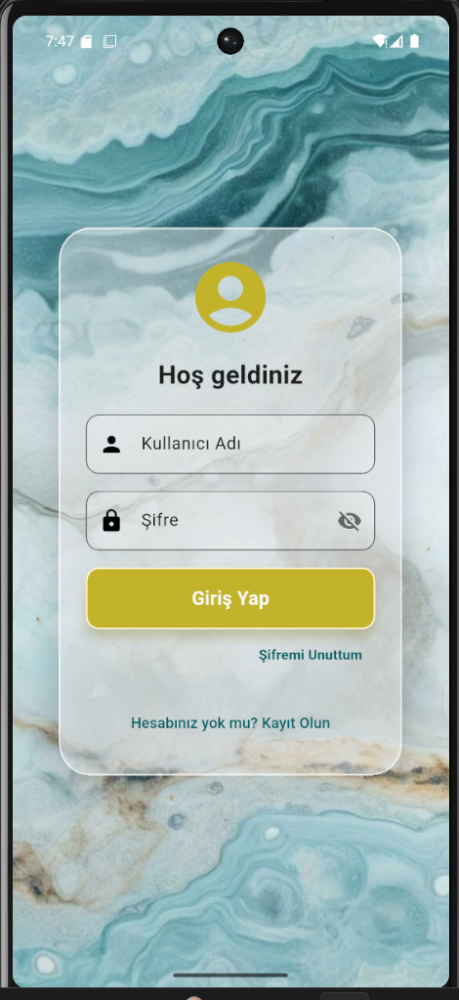
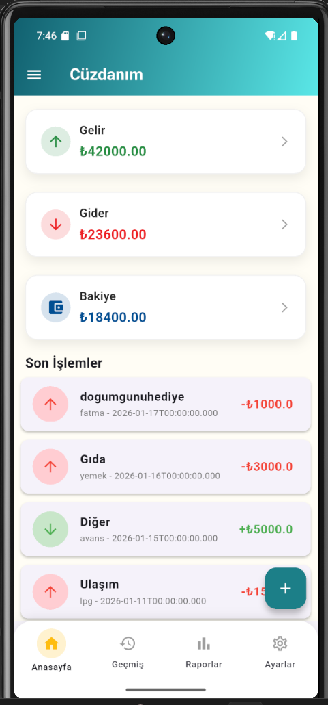
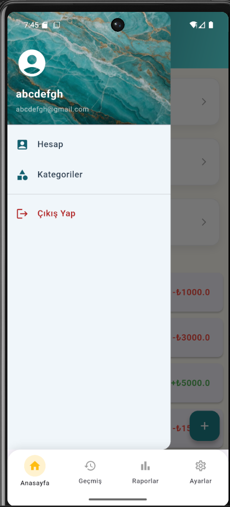
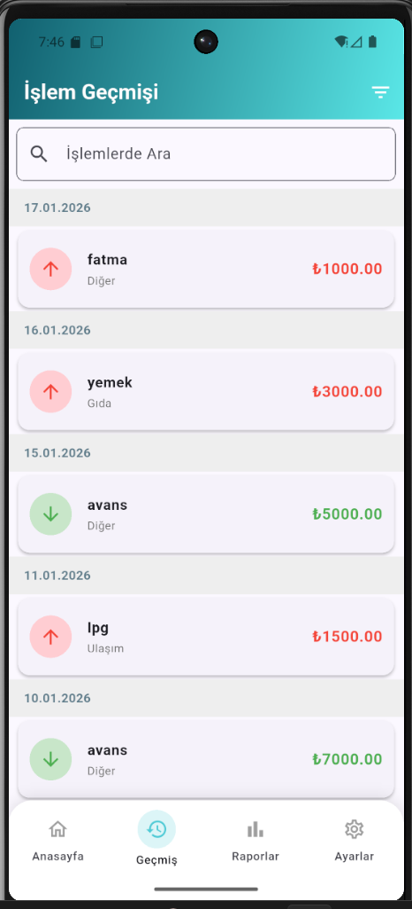
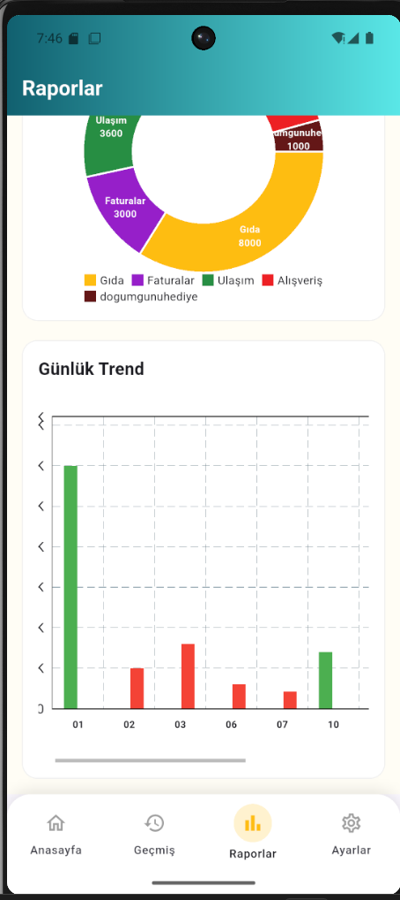

# 📱 Cüzdanım - Kişisel Finans Yönetim Uygulaması

### 📺 Proje Sunum Videosu
[](https://youtu.be/webFywCnRXI)
*Görsele tıklayarak sunum videosunu YouTube üzerinden izleyebilirsiniz.*

---

## 📝 Proje Hakkında
Cüzdanım, kullanıcıların günlük mali kayıtlarını (gelir/gider) kolayca tutabilmeleri, harcamalarını kategorize etmeleri ve finansal durumlarını görsel grafiklerle analiz etmeleri için **Flutter** ile geliştirilmiş bir mobil uygulamadır.

## ✨ Temel Özellikler
* **Anlık Bakiye Takibi:** Eklenen her işlem sonrası toplam bakiye, gelir ve gider kalemleri otomatik hesaplanır.
* **Kategorizasyon:** Harcamalar; mutfak, ulaşım, eğlence gibi kategorilere ayrılarak düzenli tutulur.
* **Görsel Raporlama:** Harcama dağılımları grafikler üzerinden takip edilebilir.
* **Geçmiş Filtreleme:** Tarih bazlı filtreleme ile geçmiş işlemlere hızlı erişim sağlanır.
* **İnteraktif Uyarı Modülü:** Bakiye bittiğinde devreye giren uyarı mekanizması ile kullanıcı deneyimi zenginleştirilmiştir.

## 🛠️ Teknik Altyapı
* **Framework:** Flutter (Dart)
* **Veritabanı:** SQLite (Yerel depolama).
* **Mimari:** Veritabanı işlemleri için `DatabaseHelper` yapısı kullanılmıştır.

## 📸 Uygulama Ekran Görüntüleri

| Giriş Ekranı | Ana Ekran | Profil |
|:---:|:---:|:---:|
|  |  |  |

| Geçmiş İşlemler | Analiz Grafikleri |
|:---:|:---:|
|  |  |

## 🚀 Kurulum ve Çalıştırma
1. Projeyi klonlayın veya indirin.
2. Ana dizinde terminali açın:
   ```bash
   flutter pub get